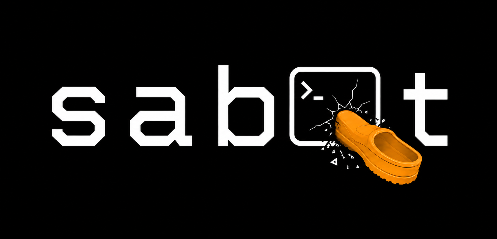

<p align="center">
  
</p>

Let your agents attack your own repos: they drive security and fuzzing tools to find holes in your code, application, and prompts. It combines deterministic scanners with agent-driven exploration, hammers your own codebase until something breaks, then reports each finding with a reproducing input or a traced path.

## Quick Start


Claude Code

```
claude plugin marketplace add srobroek/sabot
claude plugin install sabot@sabot

```

Codex

Note: Codex has not been fully tested yet, run at your own risk. 
```
codex plugin marketplace add srobroek/sabot
codex plugin add sabot@sabot
```

APM (Codex, and other APM runtimes)

```
apm marketplace add srobroek/sabot --name sabot
apm install sabot@sabot --target claude
apm install sabot@sabot --target codex
```

Pin a release by appending `@<tag>` to the marketplace-add, e.g.
`srobroek/sabot@sabot--v0.1.0`.


## Requirements

- beads (`bd`): the task-graph substrate the campaign records its run into.
  A campaign that cannot open a beads run refuses to start; there is no fallback
  store.
- A container runtime (docker, finch, or colima). Every execution phase (fuzz
  campaigns, live DAST, build-script runs) executes inside a locked-down,
  disposable container, never on the host. With no runtime present, the static and
  reading passes still run and the execution phases are reported as a coverage gap
  rather than run unconfined.


## The campaign

Point it at a repo, a diff, a hook, or an agent definition. It runs recon
first, working out what the code assumes about itself, where its trust
boundaries sit, and where it deviates from its own patterns, then attacks those
assumptions across seven surfaces:

| Surface | What it attacks |
|---|---|
| Code | injection, taint-to-sink, unsafe blocks, overflow, deserialization, ReDoS |
| Shell & hooks | command-position bypass, quoting, fail-open inversion, guard evasion |
| Agents & prompts | prompt injection, tool over-grant, exfil paths, unpinned MCP servers |
| Infra & supply chain | IaC misconfig, CI injection, secrets, malicious dependencies |
| Web & frontend | DOM-sink XSS, CSP gaps, client-side secrets, live DAST against the dev server |
| Build & toolchain | build-time execution, install scripts, the xz-tarball vector |
| Robustness | malformed-input crashes, boundary values, resource limits, silent wrong answers |

Standard scanners and fuzzers (opengrep, bandit, clippy, cargo-fuzz, nuclei, …) are
borrowed as they come; recon builds the harness that aims them and writes rules for
what no pack covers. Findings carry two axes, an evidence tier (proven /
reachable / hardening / refuted) and an impact, and are demoted rather than
dropped. It is advisory: it writes harnesses, rules, and regression tests, and
patches product code only on explicit approval.

## Why "sabot"?

A sabot is the shoe a saboteur jams into the machine. The package is `sabot` (the
tool and repo); the skill you invoke is `sabotage` (the verb). You trigger it by
asking to harden, red-team, fuzz, attack, or break something, or by naming the
`/sabotage` skill directly.


## How to use it

Invoke the skill and name a target:

```
sabotage: red-team the PreToolUse guards in packages/hooks-bash-safety
sabotage: fuzz the FITS header parser in this crate
sabotage: audit this PR for security and robustness issues
```

> ⚠️ **A full-repo scan is slow and token-hungry.** Running sabot against an
> entire repository can take an hour or more and consume a significant number of
> tokens. It is a deliberately thorough, multi-agent process. **Scope tightly:**
> point it at a single directory, a diff, a PR, or one surface. A whole-repo,
> all-surface run is the exception, not the default.

It runs a five-agent campaign per surface:

1. scout: recon per surface, producing the trust map, invariants, idiom census, and repo-specific rules
2. fuzzer: writes harnesses, seed corpora, and attack vectors (runs nothing)
3. gremlin: executes scanners and harnesses inside a container, reads for what they miss
4. triager: dedups crashes, minimizes to a smallest reproducing input, classifies
5. challenger: sets the evidence tier on every finding, independently

A sixth agent, hardener, applies an approved fix and re-verifies, only after you
say so.

### Scope modes

- full (default): every step
- quick: recon plus a smoke campaign, no new harnesses or challenger
- audit-only: describe findings, never patch (regression tests are still written)
- harness-only: author harnesses and corpora, execute nothing

### Safety

- Attacks only local code you own. Network targets, public endpoints, and live DoS stay out of scope.
- Execution is container-isolated: target mounted read-only, network denied, resource-capped, non-root
- A campaign never generates an input whose effect is irreversible; it fuzzes the code path that *receives* `rm -rf`, it never runs it
- Product code is patched only on explicit approval, behind a verification re-run

## Tools

sabot drives mature, widely-used tools rather than reinventing them. Recon
picks which apply to a target and builds the harness that aims them. Note that these tools are installed in the container on-demand depending on the agent's needs, and that these tools are driven by the agent based on its findings. 

### Static analysis & SAST

| Tool | What it does |
|---|---|
| [Semgrep](https://github.com/semgrep/semgrep) | AST/dataflow pattern scanning across languages |
| [Opengrep](https://github.com/opengrep/opengrep) | LGPL Semgrep fork with the closed rules restored |
| [Joern](https://github.com/joernio/joern) | code-property-graph interprocedural taint queries |
| [ast-grep](https://github.com/ast-grep/ast-grep) | structural search and repo-specific rule synthesis |
| [weggli](https://github.com/weggli-rs/weggli) | C/C++ semantic vulnerability pattern search |
| [Bearer](https://github.com/Bearer/bearer) | dataflow SAST for sensitive-data leak paths |
| [Ruff](https://github.com/astral-sh/ruff) · [Bandit](https://github.com/PyCQA/bandit) | Python lint + security lint |
| [Clippy](https://github.com/rust-lang/rust-clippy) · [gosec](https://github.com/securego/gosec) · [golangci-lint](https://github.com/golangci/golangci-lint) | Rust and Go lint/security |

### Fuzzing & property testing

| Tool | What it does |
|---|---|
| [AFL++](https://github.com/AFLplusplus/AFLplusplus) · [honggfuzz](https://github.com/google/honggfuzz) · [libFuzzer](https://llvm.org/docs/LibFuzzer.html) | coverage-guided native fuzzers |
| [cargo-fuzz](https://github.com/rust-fuzz/cargo-fuzz) | libFuzzer for Rust |
| [atheris](https://github.com/google/atheris) | coverage-guided fuzzer for Python |
| [Jazzer.js](https://github.com/CodeIntelligenceTesting/jazzer.js) | coverage-guided fuzzer for JS/TS |
| [Hypothesis](https://github.com/HypothesisWorks/hypothesis) · [HypoFuzz](https://github.com/Zac-HD/hypofuzz) | Python property-based + coverage-guided testing |
| [proptest](https://github.com/proptest-rs/proptest) · [fast-check](https://github.com/dubzzz/fast-check) | property testing for Rust and JS/TS |
| [radamsa](https://gitlab.com/akihe/radamsa) · [zzuf](https://github.com/samhocevar/zzuf) | seed-driven mutation fuzzers |
| [schemathesis](https://github.com/schemathesis/schemathesis) | API fuzzing from an OpenAPI/GraphQL spec |
| [Grammarinator](https://github.com/renatahodovan/grammarinator) · [dharma](https://github.com/MozillaSecurity/dharma) | grammar-based generation |

### Crash triage & minimization

| Tool | What it does |
|---|---|
| [CASR](https://github.com/ispras/casr) | crash triage, dedup by stack, severity |
| [shrinkray](https://github.com/DRMacIver/shrinkray) | generic test-case reducer |
| [C-Reduce](https://github.com/csmith-project/creduce) | C/C++ source reduction |

### Supply chain & dependencies

| Tool | What it does |
|---|---|
| [osv-scanner](https://github.com/google/osv-scanner) · [Grype](https://github.com/anchore/grype) | CVE scanning across lockfiles |
| [cargo-audit](https://github.com/rustsec/rustsec) · [cargo-deny](https://github.com/EmbarkStudios/cargo-deny) · [cargo-vet](https://github.com/mozilla/cargo-vet) | Rust advisory, licence, and audit policy |
| [cargo-semver-checks](https://github.com/obi1kenobi/cargo-semver-checks) | Rust breaking-change detection |
| [GuardDog](https://github.com/DataDog/guarddog) | malicious-package detection (typosquats, install-time exfil) |
| [OSSF Scorecard](https://github.com/ossf/scorecard) | dependency security-posture scoring |

### Secrets

| Tool | What it does |
|---|---|
| [gitleaks](https://github.com/gitleaks/gitleaks) | secret detection across the tree and git history |
| [TruffleHog](https://github.com/trufflesecurity/trufflehog) | 800+ verified secret detectors |
| [Kingfisher](https://github.com/mongodb/kingfisher) | secret scanner that live-validates a hit |

### Infra, CI & containers

| Tool | What it does |
|---|---|
| [Trivy](https://github.com/aquasecurity/trivy) · [Checkov](https://github.com/bridgecrewio/checkov) | IaC misconfig, container, and secret scanning |
| [hadolint](https://github.com/hadolint/hadolint) · [kube-linter](https://github.com/stackrox/kube-linter) | Dockerfile and Kubernetes linting |
| [zizmor](https://github.com/zizmorcore/zizmor) · [poutine](https://github.com/boostsecurityio/poutine) | CI/CD workflow-injection and supply-chain scanning |
| [actionlint](https://github.com/rhysd/actionlint) · [pinact](https://github.com/suzuki-shunsuke/pinact) | GitHub Actions lint and SHA-pinning |
| [tflint](https://github.com/terraform-linters/tflint) | Terraform provider-aware linting |

### Web & frontend

| Tool | What it does |
|---|---|
| [Nuclei](https://github.com/projectdiscovery/nuclei) | template-driven DAST against a local dev server |
| [OWASP ZAP](https://github.com/zaproxy/zaproxy) | passive/active web scanning |
| [retire.js](https://github.com/RetireJS/retire.js) | known-vulnerable JS library detection |
| [eslint-plugin-no-unsanitized](https://github.com/mozilla/eslint-plugin-no-unsanitized) | DOM-sink XSS lint |

### Shell & native

| Tool | What it does |
|---|---|
| [ShellCheck](https://github.com/koalaman/shellcheck) · [shfmt](https://github.com/mvdan/sh) | shell lint and format |
| [Miri](https://github.com/rust-lang/miri) · [cargo-careful](https://github.com/RalfJung/cargo-careful) | Rust undefined-behaviour detection |
| [cargo-geiger](https://github.com/geiger-rs/cargo-geiger) | Rust `unsafe` usage census |
| ASan / UBSan / MSan / TSan | compiler sanitizers for native builds |

### Deep analysis (opt-in)

| Tool | What it does |
|---|---|
| [CodeQL](https://github.com/github/codeql) | interprocedural taint via a queryable database |

## What ships

| Path | What |
|---|---|
| `packages/sabot/.apm/skills/sabotage/` | the skill router + reference docs |
| `.../scripts/fuzz-cli.py` | a JSON-stdin/CLI adversarial harness for any hook or guard |
| `.../scripts/run-contained.sh` | the container wrapper every execution phase runs through |
| `.../references/containers/` | per-surface Dockerfiles (rust, python, node), extensible |
| `packages/sabot/.apm/agents/` | scout, fuzzer, gremlin, triager, challenger, hardener |


License: Apache-2.0
